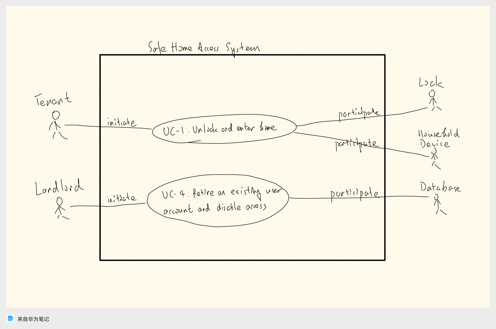

# Course Assignment (Mini Project I-1)

## Draw use case diagram for UC-1 (Unlock) and UC-4 (RetireUser)

## Write the use case schemas of UC-1 and UC-4

### Use Case UC-1: Unlock and Enter Home

#### Name / Identifier: Unlock (UC-1)

#### Related Requirements:

- REQ-1: Doors by default will be locked.
- REQ-2: Unlock the doors using a mobile phone.
- REQ-3: The system will block when it detects multiple lock-phone pairing failures.
- REQ-4: The doors will be automatically locked at all times.
Initiating Actor: Tenant

#### Actor’s Goal: To unlock the home's door and enter. 

#### Participating Actors: Lock, Household Devices, Database

#### Preconditions:

- Doors are locked.
- Tenant has the mobile application installed with proper - permissions.

#### Postconditions:

- Door is unlocked.
- Entry log is saved in the database.

#### Flow of Events for Main Success Scenario:

-> 1. Tenant sends unlock command via mobile application.
<- 2. System validates the request by checking the mobile device's authorization in the database.
<- 3. System sends a command to the lock to unlock.
<- 4. System logs the entry in the database and confirms to the Tenant.

#### Flow of Events for Extensions (Alternate Scenarios):

-> 1a. Tenant sends unlock command with an unauthorized device.
<- 2a. System denies access and logs the unauthorized attempt in the database.
-> 1b. Tenant sends multiple unsuccessful unlock attempts.
<- 2b. System blocks the mobile device temporarily and alerts the Tenant.

### Use Case UC-4: Retire an Existing User Account

#### Name / Identifier: RetireUser (UC-4)

#### Related Requirements:

- REQ-7: Manage additional user accounts.
#### Initiating Actor: Landlord

#### Actor’s Goal: To retire an existing user account and disable its access.

#### Participating Actors: Database

#### Preconditions:

- User account exists in the database.
#### Postconditions:
- User account is retired.
- The mobile device associated with the user cannot access the lock.
#### Flow of Events for Main Success Scenario:
-> 1. Landlord selects a user account to retire.
<- 2. System validates the request and checks if the user account exists.
<- 3. System retires the user account and updates the database.
<- 4. System confirms the action to the Landlord.

#### Flow of Events for Extensions (Alternate Scenarios):
-> 1a. Landlord tries to retire a non-existent user account.
<- 2a. System returns an error message stating that the user account doesn't exist.

These schemas should give a comprehensive breakdown of the interactions between the system and the actors for these specific use cases.

## Write the acceptance tests for UC-1 and UC-4

## Acceptance Test for UC-1: Unlock and Enter Home

### Test-case Identifier: TC-1-1
**Use Case Tested:** UC-1, main success scenario  
**Pass/fail Criteria:** The test passes if the Tenant successfully unlocks the door via the mobile application within the allowable attempts.  
**Input Data:** Mobile device identifier, user credentials  
**Test Procedure:** | **Expected Result:**  
--- | ---  
Step 1. Use an unauthorized mobile device to send unlock command. | System denies access; records unauthorized attempt in the database; sends notification to Tenant's authorized mobile device.  
Step 2. Send multiple unsuccessful unlock attempts. | After a defined number of attempts, system blocks the mobile device temporarily and alerts the Tenant.  
Step 3. Use an authorized mobile device with proper credentials to send unlock command. | System unlocks the door; records the entry in the database; sends a success notification to Tenant's mobile device.  

---

## Acceptance Test for UC-4: Retire an Existing User Account

### Test-case Identifier: TC-1-2
**Use Case Tested:** UC-4, main success scenario  
**Pass/fail Criteria:** The test passes if the Landlord can retire an existing user account and disable its access, and if the retired user cannot unlock the door afterward.  
**Input Data:** User account details (e.g., username, mobile device identifier)  
**Test Procedure:** | **Expected Result:**  
--- | ---  
Step 1. Select a non-existent user account to retire. | System returns an error message stating the user account doesn't exist.  
Step 2. Select an existing user account to retire. | System retires the user account and confirms the action to the Landlord.  
Step 3. Use the mobile device associated with the retired user to send unlock command. | System denies access; records unauthorized attempt in the database; sends notification to Tenant or Landlord about the denied access.
