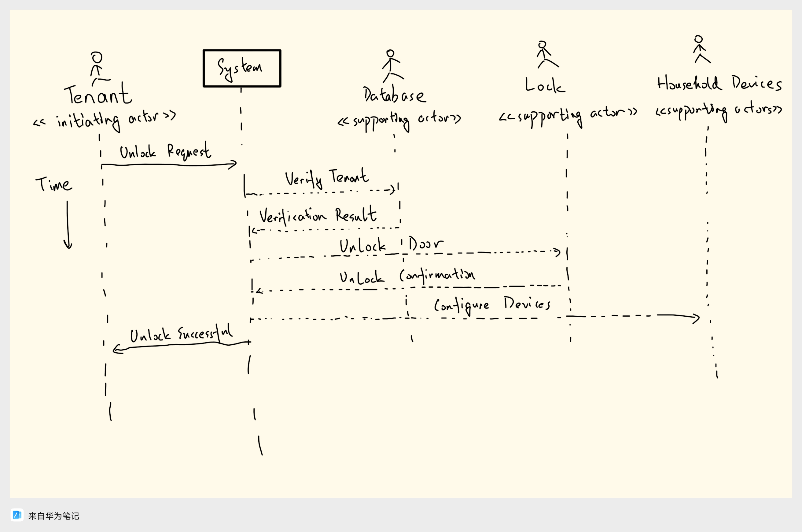
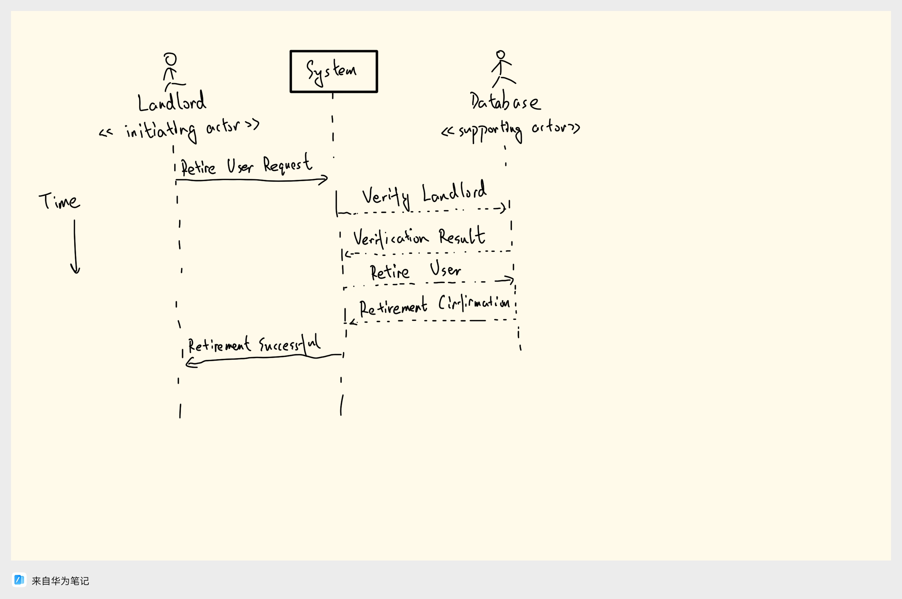
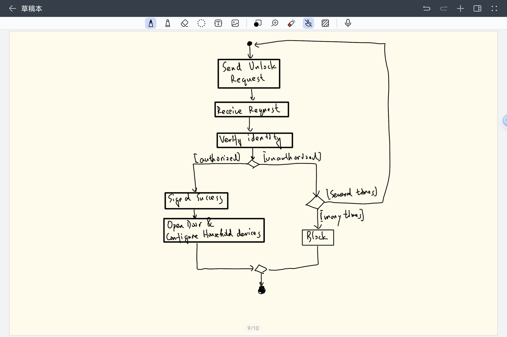
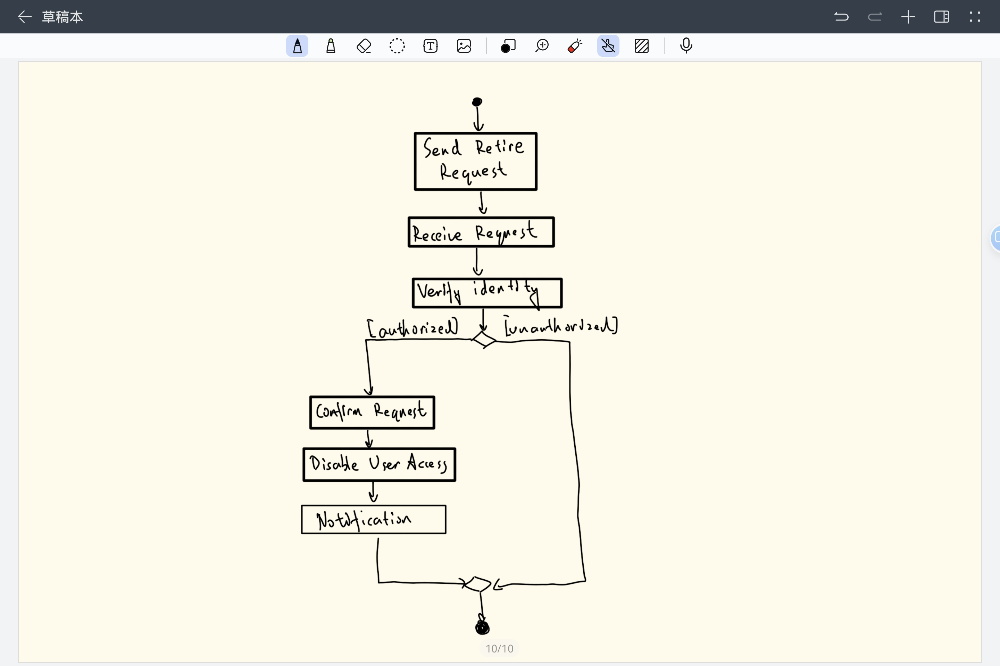

# Course Assignment (Mini Project I-2)

## Draw system sequence diagram for UC-1 (Unlock) and UC-4 (RetireUser)

### System sequence diagram for UC-1 (Unlock)

### System sequence diagram for UC-4 (RetireUser)

## Draw activity diagram for UC-1 (Unlock) and UC-4 (RetireUser)

### Activity diagram for UC-1 (Unlock)

### Activity diagram for UC-4 (RetireUser)

## Domain model for UC-4 (RetireUser): CRC分析(ref. Lec-6, P23/24/26)

### Extracting the Responsibilities

| Responsibility | Description                                                                | Type | Concept Name     |
| -------------- | -------------------------------------------------------------------------- | ---- | ---------------- |
| Rs1.           | Coordinate actions of concepts associated with this use case...            | D    | Controller       |
| Rs2.           | Identify the user account to be retired.                                   | K    | User Identifier  |
| Rs3.           | Invalidate or remove the user account from the active users' list...       | D    | Account Retirer  |
| Rs4.           | Notify the Tenant that the user account has been retired successfully.     | D    | Notifier         |
| Rs5.           | Ensure that the retired user cannot access the home anymore.               | D    | Access Validator |
| Rs6.           | Update the history of home accesses reflecting the user retirement action. | D    | History Updater  |

### Extracting the Associations

| Concept Pair                       | Association Description                        | Association Name       |
| ---------------------------------- | ---------------------------------------------- | ---------------------- |
| Controller « User Identifier       | Controller receives the user details...        | receives details       |
| Controller « Account Retirer       | Controller instructs Account Retirer...        | instructs              |
| Account Retirer « Access Validator | Ensures that the retired account...            | validates access       |
| Controller « Notifier              | Controller instructs Notifier to notify Tenant | instructs notification |
| Controller « History Updater       | Controller instructs to update the access...   | updates history        |

### Extracting the Attributes

| Concept          | Attributes          | Attribute Description                           |
| ---------------- | ------------------- | ----------------------------------------------- |
| User Identifier  | userID              | Unique Identifier for each user.                |
| Account Retirer  | retirementStatus    | Indicates whether the account...                |
| Notifier         | notificationMessage | Message content that will be sent to the Tenant |
| Access Validator | validationStatus    | Indicates whether the retirement...             |
| History Updater  | updateStatus        | Indicates whether the history...                |

### Domain model diagram for UC-4 (RetireUser):

